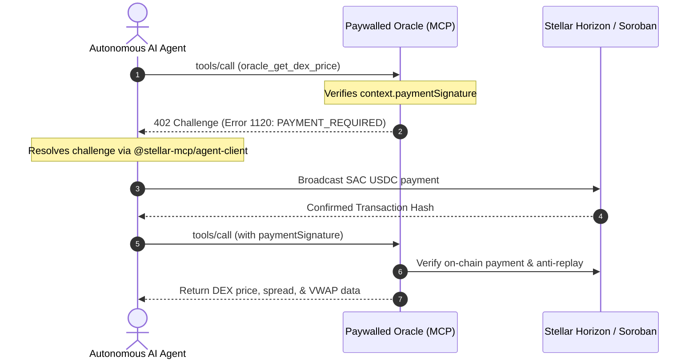

# Paywalled Oracle Server (`apps/paywalled-oracle`)

`@stellar-mcp/paywalled-oracle` is a standalone reference Model Context Protocol (MCP) server that illustrates how to monetize high-value Web3 data and analytical APIs using `@stellar-mcp/paywall`.

Every tool exposed by this server is protected by the `@x402Tool` decorator, demanding cryptographic micro-settlements in USDC settled on Stellar or Soroban before releasing data payloads.

---

## Tool Inventory

The oracle exposes three specialized financial tools:

| Tool | Price | Modality | Description |
|---|---|---|---|
| `oracle_get_dex_price` | 0.01 USDC | Soroban SAC | Real-time DEX orderbook bids, asks, spread in bps, and Volume-Weighted Average Price (VWAP) |
| `oracle_get_soroban_tvl` | 0.02 USDC | Soroban SAC | Queries contract storage and liquidity pool reserves to compute aggregate Total Value Locked |
| `oracle_get_swap_route` | 0.01 USDC | Soroban SAC | Computes optimal multi-hop strict-receive paths, price impact, and fee estimation |

---

## Architectural Workflow



---

## Implementation Details

### Paywalled DEX Price Tool

```typescript
import { z } from 'zod';
import { x402Tool } from '@stellar-mcp/paywall';

export const OraclePriceInputSchema = z.object({
  baseAsset: z.string().default('native'),
  quoteAsset: z.string().default('USDC:GBBD47IF6LWK7P7MDEVSCWR7DPUWV3NY3DTQEVFL4NAT4AQH3ZLLFLA5'),
  depth: z.number().int().positive().max(50).default(10),
});

export const paywalledPriceTool = x402Tool({
  price: '0.01',
  asset: 'CBIELTK6YBZJU5UP2WWQEUCYKLPU6AUNZ2BQ4WWUIE3USSTHZX5ACUSDC',
  recipient: 'GAIA4ZKABJY2A33LWMTLH5ZXIQBMB7SVLZWIMGP3QA633TCY7WAHYAMT',
  network: 'stellar:testnet',
  handler: async (args) => {
    return fetchDexPrice(args, 'https://horizon-testnet.stellar.org');
  },
});
```

---

## Server Deployment

The reference oracle supports dual transport protocols:

### 1. Stdio Transport (Claude Desktop / Cursor)

```bash
# Start locally via stdio
ORACLE_TRANSPORT=stdio pnpm --filter @stellar-mcp/paywalled-oracle start
```

Configure in Claude Desktop (`claude_desktop_config.json`):

```json
{
  "mcpServers": {
    "paywalled-oracle": {
      "command": "node",
      "args": ["/path/to/apps/paywalled-oracle/dist/index.js"],
      "env": {
        "ORACLE_TRANSPORT": "stdio",
        "ORACLE_MERCHANT_ADDRESS": "GAIA4ZKABJY2A33LWMTLH5ZXIQBMB7SVLZWIMGP3QA633TCY7WAHYAMT",
        "STELLAR_NETWORK": "testnet"
      }
    }
  }
}
```

### 2. SSE Network Transport

```bash
# Launch HTTP Server-Sent Events daemon
ORACLE_TRANSPORT=sse ORACLE_PORT=4020 pnpm --filter @stellar-mcp/paywalled-oracle start
```
