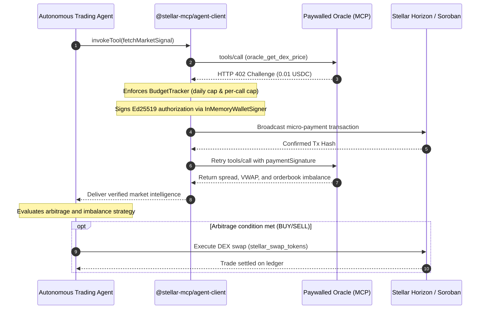

# Autonomous Trading Agent (`apps/trading-agent`)

`@stellar-mcp/trading-agent` is a production reference application showing how an autonomous AI agent consumes paid market intelligence from paywalled Model Context Protocol (MCP) servers, handles HTTP 402 challenges seamlessly, respects strict budget guardrails, and executes DEX swaps on Stellar and Soroban.

---

## Architecture Overview



---

## Strategy Engine & Imbalance Logic

The trading agent evaluates market depth across multiple dimensions:

```typescript
import { evaluateTradingOpportunity, MarketSignal } from '@stellar-mcp/trading-agent';

const signal: MarketSignal = {
  baseAsset: 'native',
  quoteAsset: 'USDC:GBBD47IF6LWK7P7MDEVSCWR7DPUWV3NY3DTQEVFL4NAT4AQH3ZLLFLA5',
  bestBid: '0.120000',
  bestAsk: '0.121000',
  midPrice: '0.120500',
  spread: '0.001000',
  spreadBps: 83,
  vwap: '0.120600',
  orderbookImbalance: 0.45,
};

// Evaluates whether imbalance and spread exceed the minimum threshold
const decision = evaluateTradingOpportunity(signal, 50, '25.0');
// decision.action -> 'BUY'
// decision.targetAmount -> '25.0'
```

---

## Institutional Safety Guardrails

To prevent run-away costs in autonomous environments, the agent configures:

1. **Daily Spending Caps**: Total USDC expenditure on paywalled tools is capped over a rolling 24-hour window.
2. **Per-Invocation Thresholds**: Invocations demanding more than the threshold are rejected immediately before any signing.
3. **Circuit Breaker**: Trips to fail-fast mode if consecutive RPC timeouts occur, stopping budget bleed during network outages.
4. **Idempotency Tracking**: In-memory and cache-backed tracking prevents double-payment across retried network requests.

---

## Running the Agent

### Standalone CLI Execution

```bash
# Run a single cycle against testnet
pnpm --filter @stellar-mcp/trading-agent start
```

### Continuous Daemon Loop

```typescript
import { AutonomousTradingAgent } from '@stellar-mcp/trading-agent';

const agent = new AutonomousTradingAgent({
  dailyBudgetUsdc: 5.0,
  maxPaymentPerInvocation: 0.05,
  minProfitBps: 50,
  pollIntervalMs: 5000,
});

// Run single evaluation cycle
const result = await agent.step();
console.log('Action:', result.decision.action);
console.log('Reason:', result.decision.reason);
```
