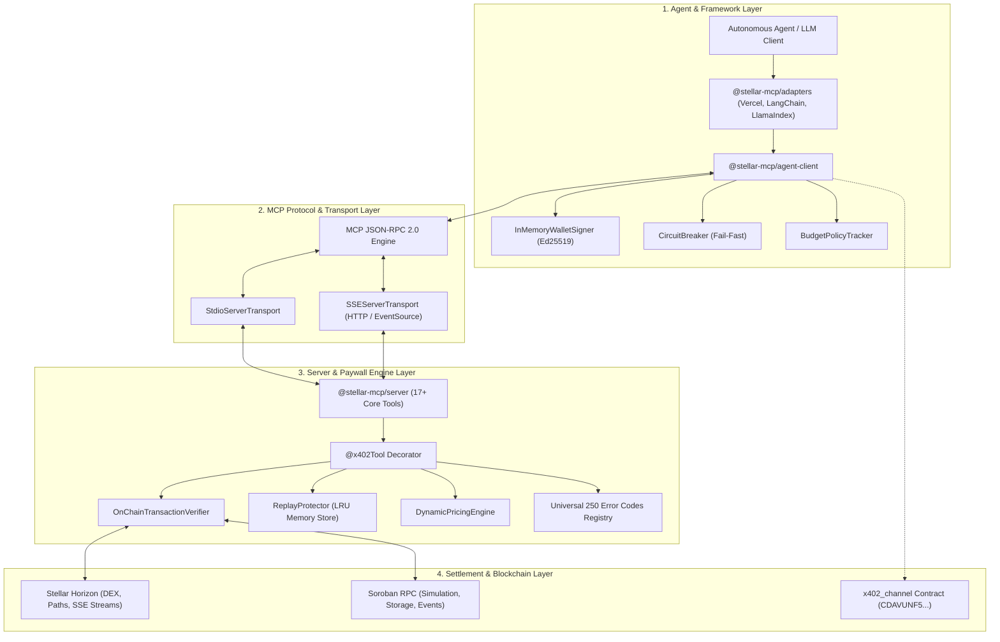
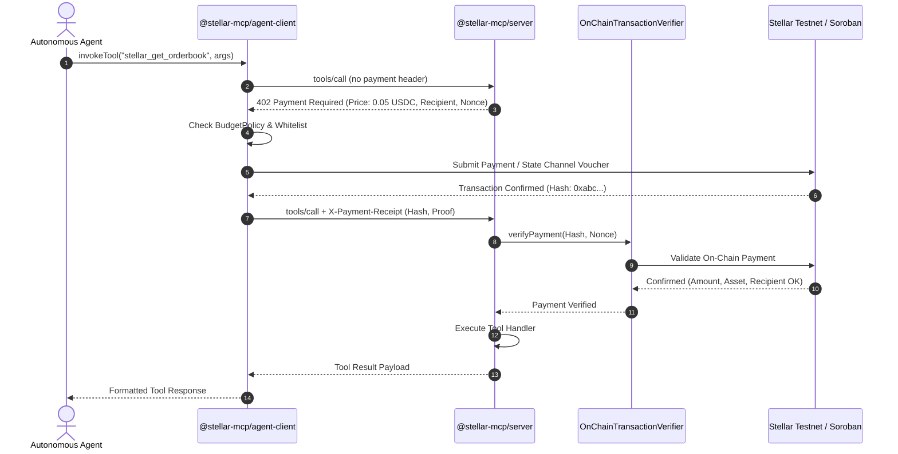

# System Architecture

Stellar x402 is structured as a 4-layer modular system designed for separation of concerns, zero private key leakage, and maximum fault tolerance under high-frequency autonomous agent workloads.

---

## The Four Architecture Layers

### 1. Agent & Framework Layer (`@stellar-mcp/agent-client`, `@stellar-mcp/adapters`)
Responsible for managing agent credentials, spending policies, and framework bridges:
- **`InMemoryWalletSigner`**: Holds Stellar Keypairs strictly in memory. Private keys are never serialized to disk, never printed in error logs, and never sent over the network.
- **`BudgetTracker`**: Enforces strict financial limits (`maxSpendPerCall`, `dailyBudget`, and `allowedRecipients`). If an agent attempts to call a tool costing more than its budget, execution halts with error code `1192` (`ERR_CLIENT_BUDGET_DAILY_EXCEEDED`).
- **`CircuitBreaker`**: Inspired by `Stellar-IndigoPay` PR #1211. Detects repeated upstream RPC failures and opens the circuit, failing fast with 0 network calls until recovery.
- **Framework Adapters**: Bridges tools seamlessly into **Vercel AI SDK Core**, **LangChain.js**, and **LlamaIndex.TS**.

---

### 2. Transport Layer (`@modelcontextprotocol/sdk`)
Manages bidirectional communication between AI agent runtime processes and the MCP server:
- **`stdio` Transport**: Standard input/output pipes used by local desktop clients (Claude Desktop, Cursor, local CLI scripts).
- **`SSE` Transport**: Server-Sent Events over HTTP with JSON-RPC message framing, allowing remote multi-tenant agent deployments.

---

### 3. Server & Paywall Engine (`@stellar-mcp/server`, `@stellar-mcp/paywall`)
Provides 17+ Stellar and Soroban tools and wraps handlers with cryptographic verification:
- **`@x402Tool` Decorator**: Intercepts unauthenticated tool calls, calculates dynamic pricing, and issues structured HTTP 402 challenges.
- **`OnChainTransactionVerifier`**: Queries Horizon or Soroban RPC to cryptographically verify:
  1. Transaction submission status is successful.
  2. Transaction operations contain a valid payment to the designated recipient.
  3. Paid asset and amount match or exceed the challenge price.
  4. Nonce or memo matches the expected challenge identifier.
- **`ReplayProtector`**: In-memory and cache-backed store that records every redeemed transaction hash with time-to-live (TTL) expiration, preventing replay attacks.
- **`Universal 250 Error Codes Registry`**: Standardized directory categorizing all failure modes with HTTP status codes and remediation guides.

---

### 4. Settlement Layer (Horizon, Soroban RPC, and `x402_channel`)
The underlying decentralized ledger execution environment:
- **Stellar Horizon**: Sub-second payment processing, DEX orderbook liquidity, path payment discovery, and ledger event streaming.
- **Soroban RPC**: Smart contract simulation, state storage inspection, and event indexing.
- **`x402_channel` Smart Contract**: Deployed on Stellar Testnet (`CDAVUNF5...`). Implements bilateral state channels where agents sign zero-fee off-chain vouchers, settling on-chain only at closing.

---

## The x402 Transaction Lifecycle

---

## Security & Threat Model

| Threat | Mitigation Strategy | Implemented In |
|---|---|---|
| **Private Key Exposure** | Signer stores Ed25519 secret seed purely in volatile RAM. `toJSON()` sanitizes all key structures. | `InMemoryWalletSigner` |
| **Replay Attacks** | Every transaction hash is registered upon verification. Subsequent attempts with the same hash fail with code `1160`. | `ReplayProtector` |
| **Agent Infinite Loops** | Hard daily spending limit and per-call spending limit enforced client-side before any signature is produced. | `BudgetTracker` |
| **Network Outage Draining** | Circuit breaker enters `OPEN` state after consecutive network timeouts, preventing repeated wasted retries. | `CircuitBreaker` |
| **Price Slippage** | Dynamic pricing engine computes deterministic fees; challenges specify maximum valid timestamp (`validUntil`). | `DynamicPricingEngine` |
