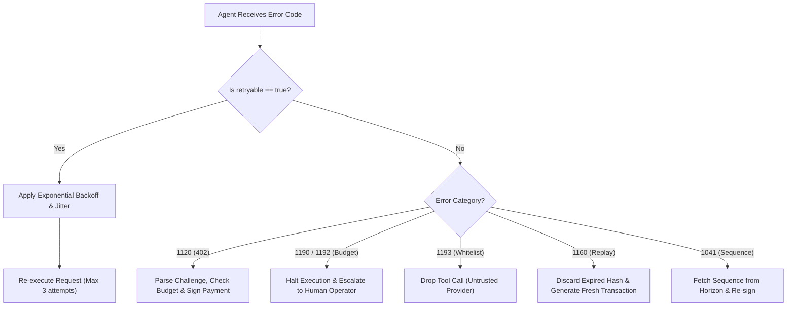

# Universal 250 Error Codes Registry

To maintain institutional reliability, `stellar-x402-mcp` implements a standardized directory of **250 unique error codes**. Every error returned by a server or client contains structured metadata explaining the exact failure mode, HTTP status code, retryability flag, and deterministic remediation instructions.

---

## Category Allocation

The 250 error codes are partitioned across seven discrete operational categories:

| Range | Count | Category | Scope |
|---|---|---|---|
| **1000 - 1039** | 40 | `PROTOCOL` | MCP JSON-RPC 2.0 framing, transport disconnection, payload limits |
| **1040 - 1079** | 40 | `HORIZON` | Account not found, sequence mismatch, trustline missing, reserve limits |
| **1080 - 1119** | 40 | `SOROBAN` | Contract traps, host budget exhaustion, storage TTL expiration |
| **1120 - 1159** | 40 | `PAYWALL` | HTTP 402 challenge errors, underpayment, asset mismatch, verifier timeout |
| **1160 - 1189** | 30 | `REPLAY` | Nonce already claimed, duplicate transaction hashes, cache overflow |
| **1190 - 1219** | 30 | `CLIENT` | Agent budget caps exceeded, circuit breaker trips, key derivation |
| **1220 - 1249** | 30 | `DEX` | Path payment no path, slippage exceeded, empty orderbook, pool imbalance |

---

## Error Payload Schema

All error responses comply with the following JSON schema:

```json
{
  "error": {
    "code": 1120,
    "slug": "ERR_PAYWALL_PAYMENT_REQUIRED",
    "category": "PAYWALL",
    "httpStatus": 402,
    "retryable": false,
    "message": "Request requires payment header (HTTP 402 Payment Required)",
    "remedy": "Generate authorization header with transaction receipt and resubmit"
  }
}
```

---

## Deterministic Remediation Reference

### Protocol & Transport (1000 - 1039)

| Code | Slug | HTTP | Retryable | Exact Remediation Path |
|---|---|---|---|---|
| `1000` | `ERR_PROTOCOL_INVALID_JSONRPC` | 400 | No | Validate jsonrpc version field is exactly "2.0" in the request payload |
| `1001` | `ERR_PROTOCOL_METHOD_NOT_FOUND` | 404 | No | Query tools/list to inspect all available tools registered on this MCP server |
| `1002` | `ERR_PROTOCOL_INVALID_PARAMS` | 422 | No | Verify input parameter names and data types against the tool schema definition |
| `1003` | `ERR_PROTOCOL_INTERNAL_ERROR` | 500 | Yes | Wait 500ms and retry with exponential backoff; check MCP server logs |
| `1008` | `ERR_PROTOCOL_REQUEST_TIMEOUT` | 504 | Yes | Increase client timeout configuration or check transport stream health |

---

### Horizon RPC & Ledger Operations (1040 - 1079)

| Code | Slug | HTTP | Retryable | Exact Remediation Path |
|---|---|---|---|---|
| `1040` | `ERR_HORIZON_ACCOUNT_NOT_FOUND` | 404 | No | Fund the account with starting balance (minimum 1 XLM) before invoking tools |
| `1041` | `ERR_HORIZON_BAD_SEQUENCE` | 409 | Yes | Fetch latest account sequence number from Horizon and resubmit transaction |
| `1042` | `ERR_HORIZON_INSUFFICIENT_BALANCE` | 400 | No | Deposit additional XLM or token collateral into the agent source account |
| `1043` | `ERR_HORIZON_NO_TRUSTLINE` | 400 | No | Establish trustline via change_trust operation before attempting token receipt |
| `1045` | `ERR_HORIZON_FEE_TOO_LOW` | 400 | Yes | Increase max_fee by 20% to account for transient surge pricing |

---

### Soroban Smart Contracts (1080 - 1119)

| Code | Slug | HTTP | Retryable | Exact Remediation Path |
|---|---|---|---|---|
| `1080` | `ERR_SOROBAN_CONTRACT_TRAP` | 500 | No | Contract panicked during execution; inspect contract logs for revert code |
| `1081` | `ERR_SOROBAN_HOST_CPU_EXHAUSTED` | 429 | Yes | Host CPU instruction budget exceeded; simplify payload or optimize state reads |
| `1082` | `ERR_SOROBAN_ENTRY_EXPIRED` | 410 | No | Contract instance or persistent storage expired; call extend_ttl before use |
| `1085` | `ERR_SOROBAN_SIMULATION_FAILED` | 400 | No | Re-simulate invocation with fresh ledger footprint to resolve state conflicts |

---

### Paywall & Verification (1120 - 1159)

| Code | Slug | HTTP | Retryable | Exact Remediation Path |
|---|---|---|---|---|
| `1120` | `ERR_PAYWALL_PAYMENT_REQUIRED` | 402 | No | Parse challenge payload, execute requested payment, and resubmit with receipt |
| `1121` | `ERR_PAYWALL_CHALLENGE_MISSING` | 400 | No | Re-invoke tool without payment header to receive a structured HTTP 402 challenge |
| `1122` | `ERR_PAYWALL_CHALLENGE_EXPIRED` | 401 | No | Challenge exceeded validUntil epoch; obtain a fresh challenge nonce |
| `1125` | `ERR_PAYWALL_SIGNATURE_INVALID` | 403 | No | Re-sign authorization challenge using authorized agent private key |
| `1126` | `ERR_PAYWALL_AMOUNT_UNDERPAID` | 402 | No | Submit payment matching or exceeding the exact challenge price |
| `1127` | `ERR_PAYWALL_ASSET_MISMATCH` | 400 | No | Remit payment using the specific asset code and issuer required by provider |

---

### Anti-Replay & Storage (1160 - 1189)

| Code | Slug | HTTP | Retryable | Exact Remediation Path |
|---|---|---|---|---|
| `1160` | `ERR_REPLAY_HASH_ALREADY_USED` | 409 | No | Transaction hash was already redeemed; generate fresh payment for this call |
| `1161` | `ERR_REPLAY_NONCE_REUSED` | 409 | No | Challenge nonce was previously spent; obtain a new challenge nonce |
| `1162` | `ERR_REPLAY_LEDGER_TOO_OLD` | 400 | No | Payment transaction ledger sequence is older than allowed verification window |

---

### Autonomous Agent Client (1190 - 1219)

| Code | Slug | HTTP | Retryable | Exact Remediation Path |
|---|---|---|---|---|
| `1190` | `ERR_CLIENT_BUDGET_CALL_EXCEEDED` | 403 | No | Tool price exceeds maxSpendPerCall; request operator review to raise limit |
| `1192` | `ERR_CLIENT_BUDGET_DAILY_EXCEEDED` | 403 | No | Daily cumulative limit reached; reset budget or wait for next 24h cycle |
| `1193` | `ERR_CLIENT_PROVIDER_NOT_WHITELISTED` | 403 | No | Merchant public key not in allowedRecipients; add provider to whitelist |
| `1198` | `ERR_CLIENT_CIRCUIT_OPEN` | 503 | Yes | Circuit breaker open due to RPC faults; wait coolDownPeriodMs before retry |
| `1200` | `ERR_CLIENT_FINALITY_TIMEOUT` | 504 | Yes | Transaction unconfirmed after polling deadline; check ledger explorer |

---

### DEX & Path Payments (1220 - 1249)

| Code | Slug | HTTP | Retryable | Exact Remediation Path |
|---|---|---|---|---|
| `1220` | `ERR_DEX_NO_PATH_FOUND` | 404 | No | No liquid orderbook path exists between source and destination assets |
| `1221` | `ERR_DEX_SLIPPAGE_EXCEEDED` | 400 | Yes | Market moved beyond destMin parameter; increase slippage tolerance or retry |
| `1225` | `ERR_DEX_EMPTY_ORDERBOOK` | 404 | No | Target asset pair has zero active bids or asks on Stellar DEX |

---

## Autonomous Agent Error Handling Flowchart


