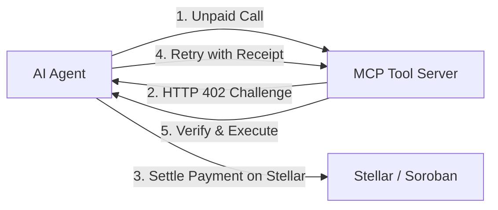

# Introduction to Stellar x402

**Stellar x402** is an open-source Model Context Protocol (MCP) tooling system and micro-payment settlement framework built on the Stellar network and Soroban smart contract platform.

It bridges the gap between autonomous AI agents (such as Claude Desktop, Cursor, LangChain, AutoGPT, and Vercel AI SDK) and decentralized financial rails. With Stellar x402, tool authors can monetize APIs and compute services on a per-call micro-payment basis, while autonomous agents can safely discover, pay for, and execute tools within deterministic spending policies.

---

## What Problem Does Stellar x402 Solve?

### 1. The Autonomous Payment Impasse
Traditional Web2 monetization models rely on credit cards, OAuth redirects, and monthly SaaS subscriptions. Autonomous AI agents cannot sign terms of service, enter CVV numbers, or pass CAPTCHA screens. When an AI agent needs specialized data (such as real-time oracle feeds, market depth, or Soroban state queries), there is no native mechanism for machine-to-machine micro-payments.

**How Stellar x402 solves this**:
Stellar x402 implements the HTTP 402 Payment Required standard natively inside the Model Context Protocol. When an agent calls a paywalled tool, the server returns an RFC-compliant cryptographic challenge specifying price, token asset, recipient address, and network. The agent client signs and settles the payment autonomously using Stellar's sub-second ledger finality.

---

### 2. High Gas Fees on Micro-Transactions
If an AI agent invokes an API 1,000 times a day, executing an on-chain smart contract transaction for every single call generates excessive transaction fees and ledger state bloat.

**How Stellar x402 solves this**:
Stellar x402 introduces `contracts/x402_channel`, an optimized Soroban state channel smart contract. Users or agents open a channel with a single deposit, exchange zero-fee cryptographic micro-vouchers off-chain with sub-millisecond latency, and settle on-chain only when closing the session. This yields **99.8% fee savings** and reduces CPU instruction consumption by **99.75%**.

---

### 3. Agent Safety & Budget Draining
Granting an autonomous agent access to a Web3 private key creates catastrophic risk of fund exhaustion if the agent enters an infinite loop, hallucinates repeated tool calls, or interacts with malicious third-party servers.

**How Stellar x402 solves this**:
The `@stellar-mcp/agent-client` library enforces rigorous client-side guardrails:
- **Per-Call Budget Caps**: Rejects any individual tool invocation exceeding pre-set limits (e.g., maximum 0.05 USDC).
- **Daily Cumulative Budget Limits**: Automatically halts agent signing once daily spend thresholds are reached.
- **Provider Whitelists**: Restricts automated payments strictly to verified merchant public keys and audited Soroban contracts.
- **Production Circuit Breaker**: Instantly fails fast during RPC downtime to prevent resource draining.

---

### 4. Rigid Payment Requirements
Most Web3 payment solutions enforce a single token (such as native ETH or SOL). If an agent holds USDC but the merchant demands XLM, the invocation fails.

**How Stellar x402 solves this**:
Stellar x402 supports **seven distinct Stellar payment modalities**:
1. **Native XLM Direct**: Sub-second settlement with zero contract dependencies.
2. **Soroban SAC Tokens**: High-precision USDC, EURC, and custom SAC assets.
3. **Path Payments (Strict Send & Receive)**: Automatic multi-hop currency conversion through Stellar DEX liquidity pools.
4. **Pre-Funded State Channels**: Zero-fee bilateral vouchers settled on Soroban.
5. **Fee-Bump Transactions**: Relayer-sponsored transactions allowing agents to pay without holding native gas reserves.
6. **Claimable Balances**: Conditional time-locked escrows for multi-step agent workflows.
7. **AMM Liquidity Swaps**: Direct pool routing for optimal execution.

---

## Architecture at a Glance

The protocol is partitioned into four independent, decoupled layers:

| Layer | Component | Functionality |
|---|---|---|
| **Agent Layer** | `@stellar-mcp/agent-client` | In-memory Ed25519 signer, budget policies, circuit breaker, multi-payment settlement engine |
| **Transport Layer** | `@modelcontextprotocol/sdk` | MCP JSON-RPC 2.0 communication over standard input/output (`stdio`) and Server-Sent Events (`SSE`) |
| **Tooling & Paywall** | `@stellar-mcp/server` & `@stellar-mcp/paywall` | 17+ Stellar tools, `@x402Tool` decorator, on-chain transaction verifier, anti-replay LRU cache, Universal 250 Error Registry |
| **Settlement Layer** | Horizon & Soroban RPC | Public Stellar Ledger, DEX orderbooks, Soroban smart contract virtual machine, `x402_channel` state channels |

---

## Next Steps

* [**Quickstart Guide**](quickstart.md)
  Install packages and run your first paywalled Stellar MCP server in 5 minutes.
* [**Architecture Deep Dive**](architecture/overview.md)
  Explore the 4-layer design, security model, and transaction lifecycle.
* [**Payment Modalities**](payments/overview.md)
  Learn how Native XLM, SAC tokens, Path Payments, and State Channels operate.
* [**Agent Adapters**](agent-frameworks/vercel-ai-sdk.md)
  Integrate Stellar tools into Vercel AI SDK, LangChain, or LlamaIndex.
