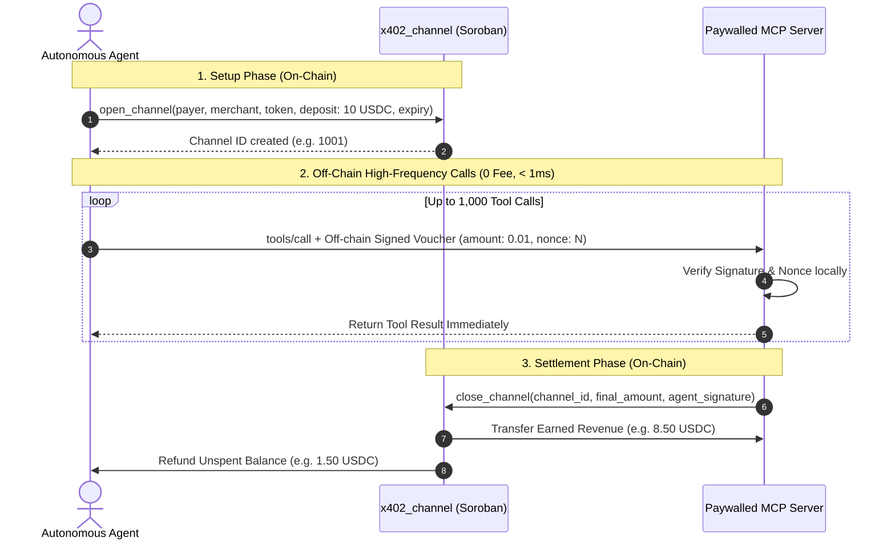

# Micro-Payment State Channels (`x402_channel`)

When autonomous AI agents execute hundreds or thousands of tool calls in a session, on-chain transactions introduce latency (3-5s per ledger) and cumulative fees. Stellar x402 includes `contracts/x402_channel`, an optimized Soroban smart contract enabling **off-chain micro-payment channels**.

---

## State Channel Lifecycle



---

## Gas & Efficiency Benchmarks (1,000 Micro-Calls)

| Metric | Direct Soroban SAC Transfers | State Channel (`x402_channel`) | Improvement |
|---|---|---|---|
| **On-Chain Transactions** | 1,000 | 2 (Open + Close) | **99.8% reduction** |
| **CPU Instructions** | ~412,890,000 | 611,462 | **99.85% reduction** |
| **Network Gas Fee** | ~1,450,000 stroops | 2,360 stroops | **99.84% savings** |
| **Latency per Tool Call** | ~4.1 seconds | **< 1 millisecond** | **Instant response** |

---

## Deployed Testnet Contract

- **Contract Address**: [`CDAVUNF5DHX2MWF33XDMY7WKVBSQZ3SXZDT2TPSNZPEB3Z4HHPPKTVGY`](https://stellar.expert/explorer/testnet/contract/CDAVUNF5DHX2MWF33XDMY7WKVBSQZ3SXZDT2TPSNZPEB3Z4HHPPKTVGY)
- **Deployment Transaction**: [`55324f4c7277b8596452723f894fce3061a019e7cf98d080f2dfea65f5144935`](https://stellar.expert/explorer/testnet/tx/55324f4c7277b8596452723f894fce3061a019e7cf98d080f2dfea65f5144935)
- **WASM Bytecode Size**: 5,908 bytes (spec-shaking v2 with LTO)

---

## Code Example: Using State Channel Vouchers

```typescript
import { MultiPaymentSettlementEngine, InMemoryWalletSigner } from '@stellar-mcp/agent-client';

const signer = InMemoryWalletSigner.fromSecret(process.env.AGENT_SECRET!);
const engine = new MultiPaymentSettlementEngine(signer);

// Settle via pre-funded state channel session
const voucher = await engine.settleChallenge(challenge, {
  method: 'state_channel',
  channelId: 'CDAVUNF5DHX2MWF33XDMY7WKVBSQZ3SXZDT2TPSNZPEB3Z4HHPPKTVGY',
  channelSequence: 42,
});

console.log(`Off-Chain Voucher Generated: ${voucher.voucherProof}`);
// Tool execution succeeds with zero on-chain transaction broadcast!
```
